# <b>Info`Mansion</b> (3D 방꾸미기 기록형SNS)

```
🏆 삼성청년SW아카데미(SSAFY) 7기 공통 프로젝트 우수상(2등) 수상
📅 개발기간 : 2022.07.05 ~ 2022.08.19
```

## 💡 <b>기획배경 및 의도</b>

`온라인에서 나만의 공간을 가질 수 있는 SNS`

기존의 기록형 SNS에서 나만의 공간을 가지기에는 진입장벽이 존재.
방을 꾸미면서 나만의 공간을 통해 나 자신을 보여주며 타인과 공유하는 웹 큐레이딩 SNS

## 🔍 <b>주요 기능</b>

### <b>사용자 탐색</b>

- 사용자 추천 알고리즘을 통해 추천.
- 무한스크롤을 통해 끊김없는 사용자 탐색.


### <b>마이룸</b>

- 사용자 정보 확인.
- 팔로우 기능.
- 가구에 설정된 태그 확인
- 방명록 확인.


### <b>방꾸미기</b>

- 슬라이더바를 통해 가구 위치 설정.
- 가구별 카테고리 설정.

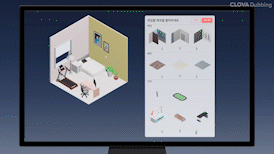

### <b>글 포스팅</b>

- 임시저장 기능.
- 1일 5번 크레딧 획득 가능.

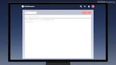

### <b>상점</b>

- 가구 타입별 확인 가능.
- 페이징 처리.

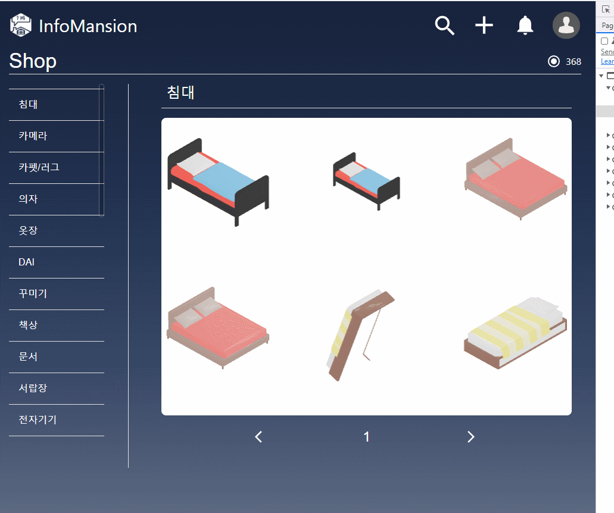

## 🛠 <b>기술 스택</b>

### <b>Frontend</b>


<details>
<summary>상세 기술스택 및 버전</summary>
 
| 기술스택                    | 버전    |
| --------------------------- | ------- |
| React                       | 18.0.0  |
| mui                         | 5.9.0   |
| axios                       | 0.27.2  |
| moment                      | 2.29.4  |
| @react-spring/three         | 9.5.0   |
| @react-three/drei           | 9.16.6  |
| @react-three/fiber          | 8.3.0   |
| @react-three/postprocessing | 2.6.1   |
| Next.js                     | 12.2.2  |
| react-cookie                | 4.1.1   |
| react-quill                 | 2.0.0   |
| Recoil                      | 0.7.4   |
| react-spring                | 5.9.0   |
| Node.js                     | 16.16.0 |

</details>

### <b>Backend</b>


<details>
<summary>상세 기술스택 및 버전</summary>
 
| 기술스택                    | 버전    |
| --------------------------- | ------- |
| Java | 11 |
| Spring Boot | 2.7.1 |
| Spring Boot Starter Data JPA | 2.7.1 |
| Spring Boot Start Security | 2.7.1 |
| Spring Boot Start OAuth2 Client | 2.7.1 |
| Spring Boot Start Validation | 2.7.1 |
| Spring Boot Starter Web | 2.7.1 |
| Spring Boot Starter Mail | 2.7.1 |
| Spring Boot Starter Data Redis | 2.7.1 |
| Spring Rest Docs | 2.7.1 |
| Spring Cloud Starter AWS | 2.2.6 |
| Lombok | 1.18.24 |
| JJWT API | 0.11.2 |
| JJWT Impl | 0.11.2 |
| JJWT Jackson | 0.11.2 |
| Maria DB | 10.6.7 |
| Redis | Latest |
| H2 | 1.4.200 |
| Jsoup | 1.15.2 |
</details>

### <b>Dev-Ops</b>


<details>
<summary>상세 기술스택 및 버전</summary>
 
| 기술스택                    | 버전    |
| --------------------------- | ------- |
| Ubuntu | 20.04 |
| Docker | 20.10.4 |
| Jenkins | 2.346.2 |
| Nginx | 1.18.0 |
</details>

### <b>협업 관리 Tools</b>


## 📐 <b>시스템 아키텍처</b>

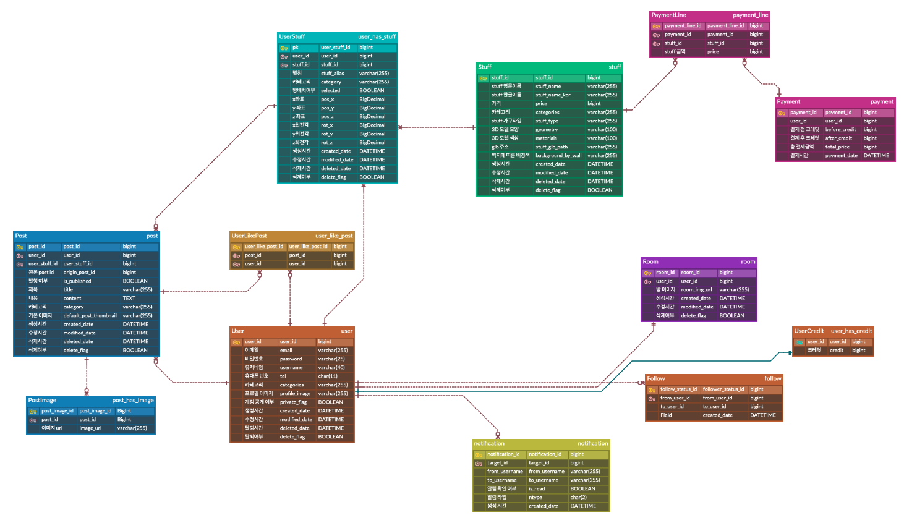

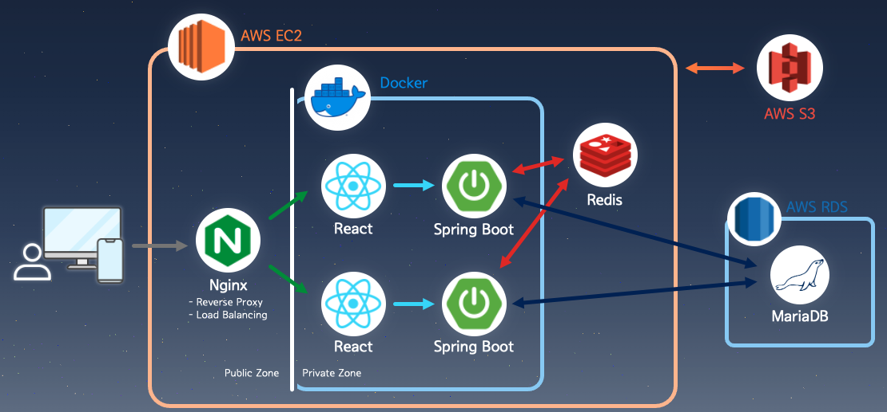

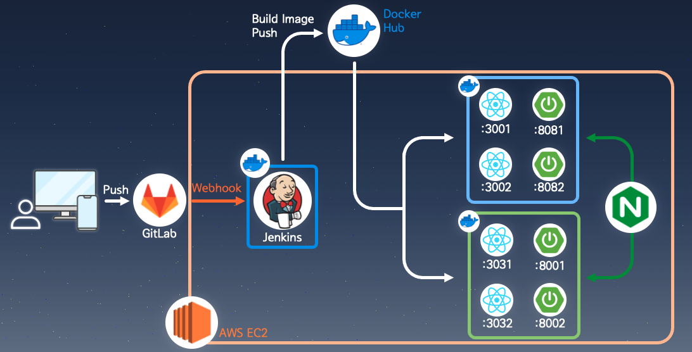

| 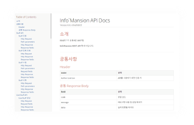 | 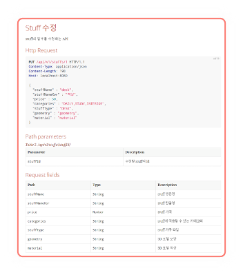 |
| -------------------------------- | --------------------------------- |

## 🎥 <b>프로젝트 소개 영상</b>

[[삼성청년SW아카데미 서울6반 A607 공통프로젝트 영상]](https://youtu.be/YrImXh4ySJ8)

## 👨🏻‍💻 <b>Info`Mansion팀 소개</b>

| 박민석 (팀장)             | 이창엽          | 장한걸                 | 김가영         | 노수빈                                 | 신치용                 |
| ------------------------- | --------------- | ---------------------- | -------------- | -------------------------------------- | ---------------------- |
| 팀장, FE                  | FE              | FE                     | BE             | BE                                     | BE                     |
| MainPage, Post 기능 및 UI | User 기능 및 UI | Room 기능 및 3D Design | Post, Room API | Stuff, UserStuff API, Spring Rest Docs | User API, 인증, DevOps |

## 💻 <b>협업 관리</b>

## <b>Gitlab</b>

### Github Flow 전략

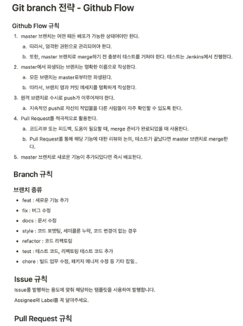

### Label

| 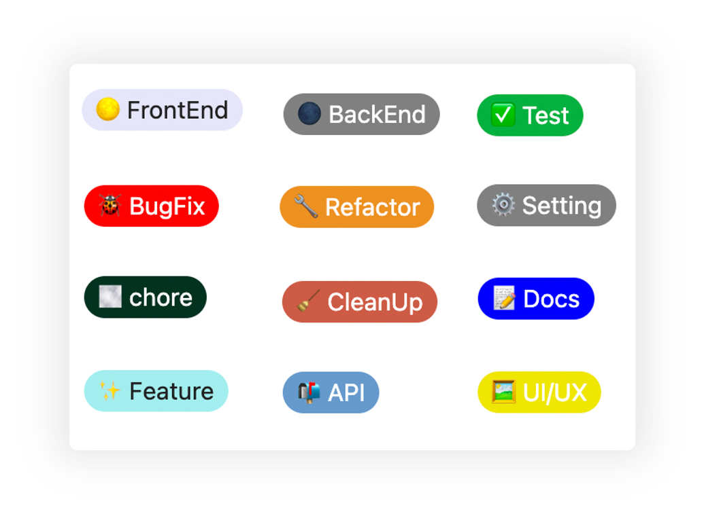 | 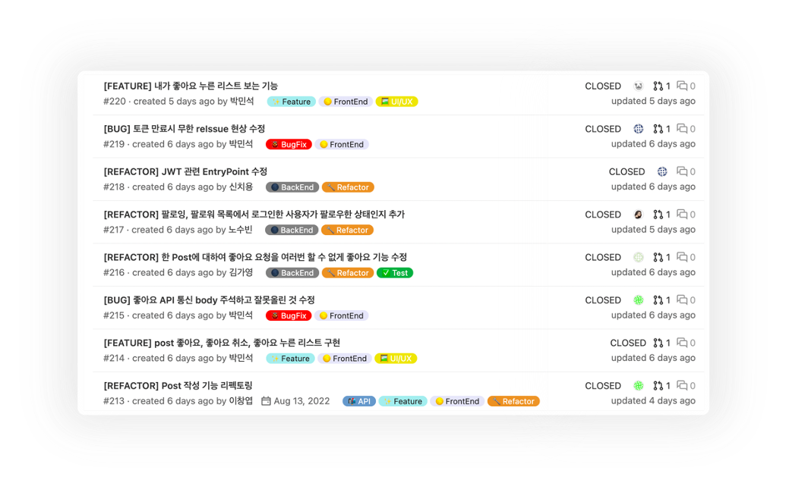 |
| -------------------------- | ----------------------------- |

### Squash, Fast-Forward Merge 이용

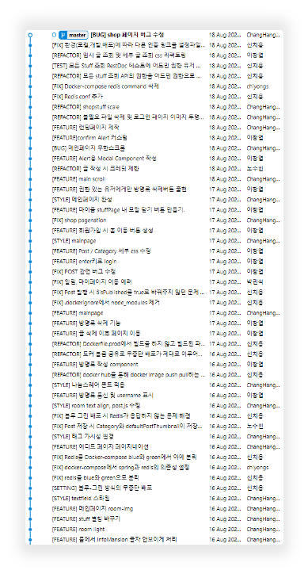

## <b>Notion</b>

> 노션 링크 : [[Info`Mansion Notion]](https://chill-buzzard-75f.notion.site/Info-Mansion-9c576639583c47108c7811f3e325014d)

### Daily Scrum & Sprint

|  |  |
| ------------------------------------------- | ------------------------------------------- |
