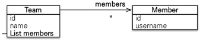
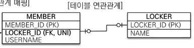
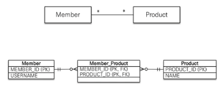
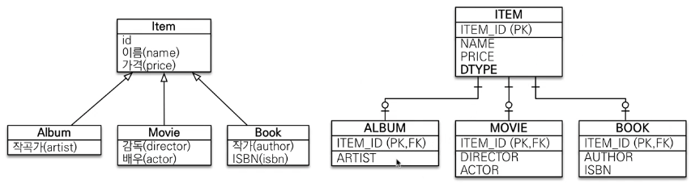
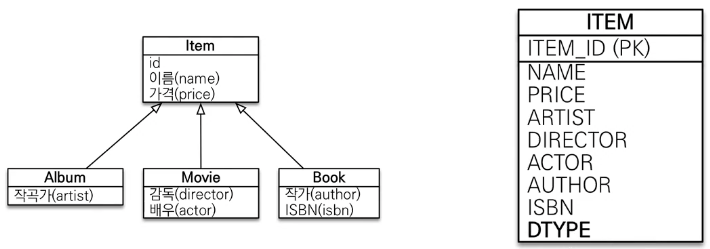
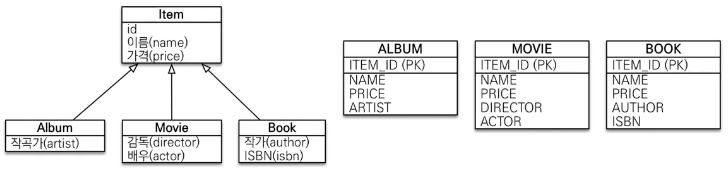
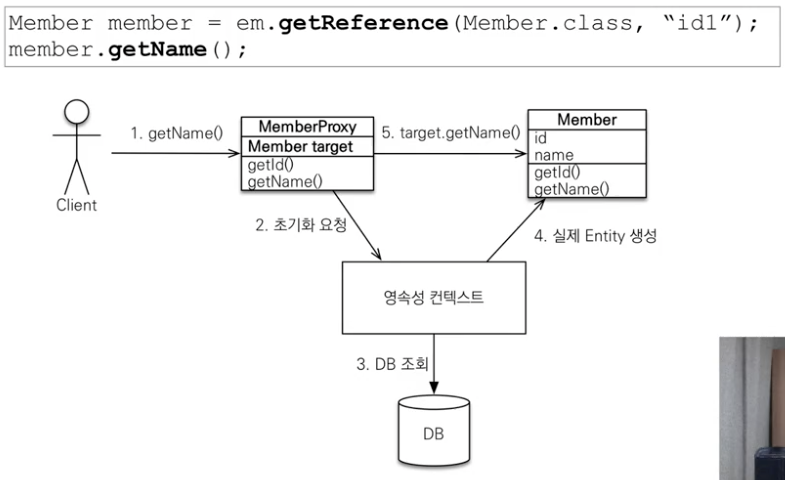

# JPA - 연관관계

## 다대일 [N:1] - @ManyToOne

DB 테이블 설계 시 **N** 쪽에 **외래키** 설정

→ 외래키가 있는 Entity에 참조값 설정(**연관관계의 주인**)

```java
@ManyToOne
@JoinColumn(name = "member_id")
private Member member;
```

---

## 일대다 [1:N] - @OneToMany

```
💡 권장하지 않는 방법!
최대한 다대일 단방향을 이용하자!!!
```

DB 테이블 설계 시 무조건 N 쪽에 외래키를 설정해야한다.

→ 하지만 외래키가 없는(1) Entity에 참조값 설정



Team.members.add(new Member()) 시, 실제로는 Member테이블의 Team 외래키를 Update하는 쿼리문이 한번 더 날라가게 된다.

만약 양방향으로 설정하고 싶다면…?!

**@ManyToOne @JoinColumn(name=”fk”, insertable = false, updatable = false**)

**insertable = false, updatable = false** → 읽기전용으로 만든다…!

---

## 일대일 [1:1] - @OneToOne

주 테이블이나 대상 테이블 중에 외래 키 선택 가능

1. 주 테이블에 외래 키
2. 대상 테이블에 외래 키



주 테이블은 MEMBER, 대상 테이블은 LOCKER로 설정

> 주 테이블에 외래키 설정

다대일 단방향 매핑과 유사, **외래키가 있는 곳이 연관관계의 주인**

> 대상 테이블에 외래키 설정

절대 불가능!!

---

## 다대다 [N:M] - @ManyToMany

```
💡 실무에서 아예 쓰지 않는 방법
```



**@ManyToMany**
**@JoinTable(name = “MEMBER_PRODUCT”)** 을 이용하여 중간 테이블을 생성해주면 된다.

→ @ManyToMany를 사용하지 않고, 중간테이블을 Entity로 생성한 후 @ManyToOne, @OneToMany를 적용하는 방식을 이용하자!

<br>
<br>
<br>

# JPA - 고급매핑

## 상속관계 매핑

관계형 데이터베이스에는 상속관계가 존재하지 않지만 객체에는 존재한다.

```
💡 Annotation


1. @Inheritance(strategy = InheritanceType.XXX)
   - JOINED : 조인전략 (Default로 조인전략 선택하자)
   - SINGLE_TABLE : 단일테이블 전략 (단순한 관계이면 단일테이블도 좋다)
   - TABLE_PER_CLASS : 구현 테이블마다 테이블 전략 (사용 X)
2. @DiscriminatorColumn
3. @DiscriminatorValue

```

### 상속관계 전략

- 조인전략

  

  ```java
  @Entity
  @Inheritance(strategy = InheritanceType.JOINED)
  @DiscriminatorColumn
  public class Item {

      @Id @GeneratedValue
      private Long id;

      private String name;
      private int price;
  }
  ```

- 단일 테이블 전략

  

  ```java
  @Entity
  @Inheritance(strategy = InheritanceType.SINGLE_TABLE)
  public class Item {

      @Id @GeneratedValue
      private Long id;

      private String name;
      private int price;
  }
  ```

  - 단일 테이블 전략은 @DiscriminatorColumn이 없어도 DTYPE이 필수로 생성된다.

- 구현 클래스마다 테이블 전략 - **_쓰면 안되는 전략_**

  

  ```java
  @Entity
  @Inheritance(strategy = InheritanceType.TABLE_PER_CLASS)
  public abstract class Item {

      @Id @GeneratedValue
      private Long id;

      private String name;
      private int price;
  }
  ```

---

## Mapped Superclass - 매핑 정보 상속

상속관계와 상관 없이 공통 속성이 존재할 경우 따로 class를 생성하여 상속받는 방식(Entity가 아님)

☑️  추상클래스로 만드는 것을 추천

```java
@MappedSuperclass
public abstract class BaseEntity {
    private LocalDateTime createdDate;
    private LocalDateTime lastModifiedDate;
    private String createdBy;
		private String lastModifiedBy;
}
```

<br>
<br>
<br>

# JPA - 프록시와 연관관계 관리

## 프록시

```
💡 em.find() vs em.getReference()


em.find() : 데이터베이스를 통해서 조회한 엔티티
em.getReference() : 데이터베이스 조회를 미루는 가짜(프록시) 엔티티

```

### 프록시의 특징

- 실제 클래스를 상속 받아서 생성된다.
- 실제 객체의 참조를 보관



처음엔 target이 없으므로 영속성 컨텍스트에 초기화 요청을 보낸다.
실제 Entity를 target에 연결한다.

- 프록시 객체는 처음 사용할 때 한 번만 초기화!!
  - 초기화 시 프록시 객체는 실제 엔티티로 바뀌는 것이 아니기 때문에 타입 체크 시 `instance of`를 사용해야 한다.
- 만약 영속성 컨텍스트에 찾는 Entity가 존재한다면 Proxy가 아닌 실제 Entity로 변경된다.
- 준영속 상태일 때 프록시 초기화 문제 발생

### 프록시 확인

```java
/*
프록시 인스턴스 초기화 여부
*/
emf.getPersistenceUnitUtil().isLoaded(findMember);

/*
프록시 클래스 확인 방법
*/
entity.getClass();

/*
프록시 강제 초기화
*/
Hibernate.initialize(entity);
```

### 왜 Proxy를 배우는가?

즉시 로딩과 지연 로딩에 대해 이해하기 위해서…!

---

## 즉시로딩과 지연로딩

`❓ Member를 조회할 때 연관관계인 Team도 함께 조회해야 할까? → 가장 큰 고민점`

### 지연로딩 (Lazy)

```java
@ManyToOne(fetch = FetchType.LAZY)    // Lazy 프록시 설정
@JoinColumn(name = "TEAM_ID")
private Team team;
```

```java
// 이 당시에는 Member만 조회!
Member m = em.find(Member.class, member.getId());

// 이 때는 Team에대한 Proxy 생성
System.out.println("m = " + m.getTeam().getClass());

// 실제 Team을 사용하는 시점에서 target이 조회
m.getTeam().getName();
```

### 즉시로딩 (EAGER)

```java
@ManyToOne(fetch = FetchType.EAGER)    // EAGER 프록시 설정
@JoinColumn(name = "TEAM_ID")
private Team team;
```

```java
// 이 당시에는 Member와 Team 전부 조회
Member m = em.find(Member.class, member.getId());

// 이미 조회가 된 상태이므로 Proxy가 아닌 Team Entity 출력
System.out.println("m = " + m.getTeam().getClass());
m.getTeam().getName();
```

### 🙏🏻 실무에서는 즉시로딩을 사용하지 않는다🙏🏻

가급적 지연로딩만 사용한다. → 다음과 같은 문제 발생

- 즉시 로딩을 적용하면 JOIN 시 예상하지 못한 SQL 문제 발생
- 즉시 로딩에서는 JPQL에서 N+1 문제 발생
  - JPQL select 쿼리 1번 날린 후 결과 개수 N개에 대해 연관관계를 가져오고자 N번의 쿼리를 추가로 날림 ⇒ N+1 문제
  - 지연로딩으로 해결가능하지만 fetch join / Entity Graph 방법으로 해결 가능

---

## 영속성 전이 : CASCADE

```
💡 부모를 저장할 때 연관된 자식도 persist를 호출하기 위해 사용하는 기능


```

```java
Child child1 = new Child();
Child child2 = new Child();

Parent parent = new Parent();

parent.addChild(child1);
parent.addChild(child2);

// persist 시 3줄의 코드가 필요함...
em.persist(child1);
em.persist(child2);
em.persist(parent);
```

⬇️

```java
@OneToMany(mappedBy = "parent", cascade = CascadeType.ALL)
private List<Child> childList = new ArrayList<>();
```

```java
Child child1 = new Child();
Child child2 = new Child();

Parent parent = new Parent();

parent.addChild(child1);
parent.addChild(child2);

em.persist(parent);
```

---

## 고아 객체

부모 엔티티와 연관관계가 끊어진 자식 엔티티를 자동으로 삭제하는 기능 `orphanRemoval = true`

- 특정 엔티티가 개인 소유할 때 사용
