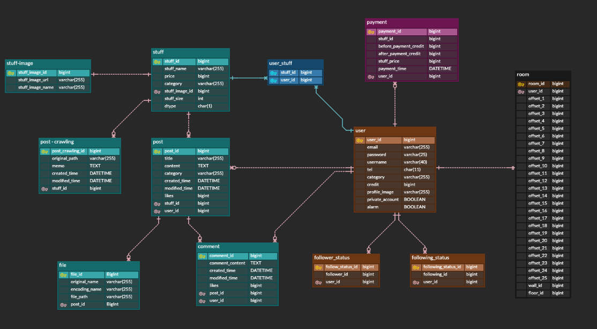
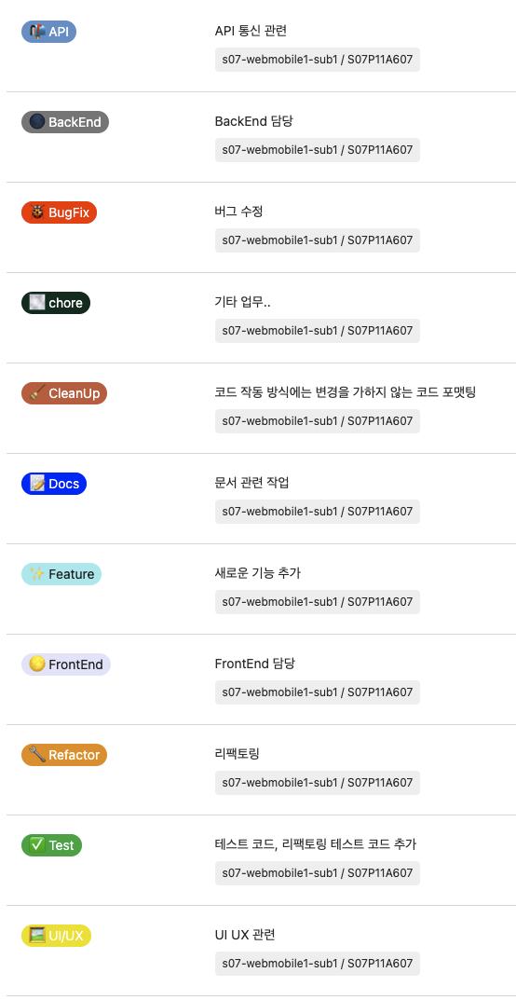
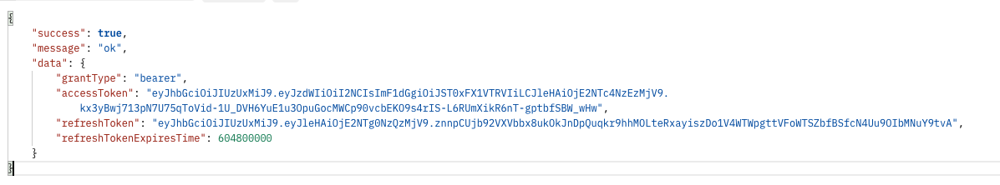

# Sub1
## ERD


백엔드 팀원들과 함께 저희 프로젝트의 ERD를 작성했습니다.

---

## 협업을 더 잘 해보자
### Git branch 전략
Git branch 전략에는 크게 3가지가 있습니다.
- Git flow
- GitHub flow
- GitLab flow

그 중 저희 팀은 GitHub flow 전략을 채택했습니다.  
저는 팀에서 GitHub Flow 전략을 잘 사용하기 위해 여러 규칙을 정의했습니다.

#### GitHub Flow 규칙
1. master 브랜치는 어떤 때든 배포가 가능한 상태여야만 한다.
   1. master 브랜치는 엄격한 권한으로 관리되며 Direct Push가 금지된다.
   2. master 브랜치로 merge하기 전 충분히 테스트를 거쳐야 한다. 테스트는 CI CD 툴에서 진행한다.
2. master에서 파생되는 브랜치는 명확한 이름으로 작성한다.
   1. 모든 브랜치는 master로부터만 파생된다.
   2. 브랜치 명과 커밋 메세지를 명확하게 작성한다.
3. 원격 브랜치로 수시로 push가 이루어져야 한다.
   1. 지속적인 push로 자신의 작업물을 다른 사람들이 자주 확인할 수 있도록 한다.
4. Pull Request(GitLab에선 Merge Request)를 적극적으로 활용한다.
   1. 코드 리뷰 또는 피드백, 도움이 필요할 때, merge 준비가 완료되었을 때 사용한다.
   2. Pull Request를 통해 해당 기능에 대한 리뷰와 논의, 테스트가 끝났다면 master브랜치로 merge한다.
5. master 브랜치로 새로운 기능이 추가되었다면 즉시 배포한다.

아직 CI/CD 라인이 구성되지 않아 몇몇 부분은 지켜지지 않지만 최대한 해당 규칙들을 지켜나가고 있습니다.

### 컨벤션 정의
GitLab을 통해 같이 협업하면서 사용한 Branch, Issue, Commit에 대한 컨벤션을 정의했습니다.

- feat : 새로운 기능 추가
- fix : 버그 수정
- docs : 문서 수정
- style : 코드 포맷팅, 세미콜론 누락, 코드 변경이 없는 경우
- refactor : 코드 리펙토링
- test : 테스트 코드, 리펙토링 테스트 코드 추가
- chore : 빌드 업무 수정, 패키지 매니저 수정 등 기타 잡일..

또한, 백엔드 내에서 지켜야 할 프로젝트 패키지 구조도 및 엔티티 규칙, 예외처리 규칙 등에 대한 코딩 컨벤션을 정의했습니다.

### Issue 티켓에 사용할 Label 제작
Issue 티켓의 명시성을 높여주는 Label을 Custom했습니다.  


### 커밋 로그 관리
GitHub에서 커밋 로그를 깔끔하게 관리하기 위해 Squash and merge를 사용했었는데 GitLab에서는 Squash and merge를 해도 Merge commit이 항상 생성됐다.  
GitLab에서 merge commit을 생성하지 않기 위해서는 Fast-forwad merge를 사용해야 한다.

---

## Spring Security
### Deprecated된 WebSecurityConfigurerAdapter
기존 진행했던 프로젝트에서 Spring Security를 사용한 경험이 있습니다.  
하지만, 현 프로젝트를 진행하면서 Spring 버전이 올라가면서 Spring Security에 변화가 생겼습니다.
Security 관련해서 설정을 하기 위해
```java
@Configuration
public class WebSecurityConfig extends WebSecurityConfigurerAdapter {
    ...
}
```
이런 식으로 사용해왔습니다.  
하지만, WebSecurityConfigurerAdapter 가 deprecated 되었습니다.

Spring 공식블로그에 따르면, Spring Security 5.7.0-M2 부터 WebSecurityConfigurerAdapter가 deprecated되었다고 합니다.  
그 이유는 바로 `component-based security configuration`로의 사용자들의 전환을 격려하기 위함이라고 합니다.  
이런 새로운 스타일의 설정으로의 이동을 돕기 위해, Spring 팀은 많은 use-case들과 앞으로 나올 대안들을 정리하고 분석했다고 합니다.
이제 Deprecated된 WebSecurityConfigurerAdapter를 놓아주면서 어떤 방식으로 변경되었는지 공부했습니다.  

#### HttpSecurity
기존 방식
```java
@Configuration
public class SecurityConfiguration extends WebSecurityConfigurerAdapter {

    @Override
    protected void configure(HttpSecurity http) throws Exception {
        http
            .authorizeHttpRequests((authz) -> authz
                .anyRequest().authenticated()
            )
            .httpBasic(withDefaults());
    }

}
```

새로운 방식
```java
@Configuration
public class SecurityConfiguration {

    @Bean
    public SecurityFilterChain filterChain(HttpSecurity http) throws Exception {
        http
            .authorizeHttpRequests((authz) -> authz
                .anyRequest().authenticated()
            )
            .httpBasic(withDefaults());
        return http.build();
    }

}
```

### Custom Response
API의 결과에 더 많은 정보를 담아서 반환하기 위해 Custom Response를 제작했습니다.
```java
public class CommonResponse<T> extends BasicResponse {

    private boolean success;
    private String message;
    private T data;

    public CommonResponse(T data) {
        this.success = true;
        this.data = data;
        this.message = "ok";
    }

    public CommonResponse<T> ok(T data) {
        return new CommonResponse<>(data);
    }

}
```
```java
public class ErrorResponse extends BasicResponse {

    private boolean success;
    private String message;

    protected ErrorResponse(ErrorCode errorCode) {
        this.success = false;
        this.message = errorCode.getMessage();
    }

    public static ResponseEntity<ErrorResponse> error(CustomException e) {
        return ResponseEntity
                .status(e.getErrorCode().getStatus())
                .body(new ErrorResponse(e.getErrorCode()));
    }
}
```

### 401 UnAuthorized, Spring Security
새롭게 만든 `CommonResponse`와 `ErrorResponse`를 사용해 간단하게 WebMvcTest 테스트를 진행했는데 401 UnAuthorized 에러가 계속 발생했습니다.  
그것은 바로 테스트 진행 시 발생하는 Request들에 대해 Spring Security가 권한이 없는 사용자로 처리했기 때문입니다.  
따라서, `@WithMockUser` 어노테이션을 통해 `SpringContextHolder`에 `UsernamePasswordAuthenticationToken`을 담아주는 방식으로 해결했습니다.
```java
@WebMvcTest(controllers = ApiResponseTestController.class)
class ApiResponseTest {

    @Autowired
    private MockMvc mockMvc;

    @DisplayName("ApiResponse가 지정된 형식에 맞게 잘 출력된다.")
    @WithMockUser
    @Test
    void ApiResponse_성공() throws Exception {
        mockMvc.perform(
                get("/test/success"))
                .andExpect(status().isOk())
                .andExpect(jsonPath("$.success").value("true"))
                .andExpect(jsonPath("$.message").exists())
                .andExpect(jsonPath("$.data").exists())
                .andExpect(jsonPath("$.data").value("test"));
    }

    @DisplayName("ErrorResponse가 지정된 형식에 맞게 잘 출력된다.")
    @WithMockUser
    @Test
    void ApiResponse_실패() throws Exception {
        mockMvc.perform(
                        get("/test/error"))
                .andExpect(status().isBadRequest())
                .andExpect(jsonPath("$.success").value("false"))
                .andExpect(jsonPath("$.message").exists())
                .andExpect(jsonPath("$.message").value("지원하지 않는 Http Method 방식입니다."));
    }
}
```
### CSRF
Spring Security를 적용하면서 또 다른 문제를 마주했습니다.  
POST 요청에 대한 테스트를 진행할 때마다 `403 Forbidden` 에러가 발생했습니다.  
GET 요청에 대한 테스트는 모두 통과가 됐기 때문에 Spring Security의 어떤 설정이 문제인지 인지하기 어려웠습니다.  
POST 요청에 대한 403 Forbidden 에러 문제는 바로 Spring Security가 기본적으로 csrf에 대해 체크하기 때문에 발생한 문제였습니다.
> CSRF(Cross-Site Request Forgery)는 사이트 간 요청 위조입니다. 웹 애플리케이션의 취약점 중 하나로, 이용자가 의도하지 않은 요청을 통한 공격을 의미합니다.  
> 즉, 인터넷 사용자가 자신의 의지와는 무관하게 공격자가 의도한 행위를 특정 웹사이트에 요청하도록 만드는 공격입니다.

하지만, 대부분 Spring Security를 도입하는 곳에서는 csrf 기능을 비활성화합니다.  
그 이유는 CSRF는 서버 측에서 전체 HTML을 생성하는 구조에서 주로 발생합니다.  
현재의 많은 애플리케이션은 주로 REST API의 엔드포인트에 의존하는 구조이며 대부분 JSON 방식으로 통신을 합니다.  
REST API는 Http의 형식을 따르기 때문에 Stateless한 속성을 가지며 서버 쪽의 세션이나 브라우저 쿠키에 의존하지 않습니다.  
따라서, 이런 API는 CSRF 공격을 받을 가능성이 존재하지 않기 때문에 비활성화하여 사용합니다.
```java
@Bean
public SecurityFilterChain filterChain(HttpSecurity http) throws Exception {
    http
        .csrf().disable()
        ...
    return http.build();
}
```

## 로그인 및 인증
### JWT
저희 프로젝트는 JWT(Json Web Token)을 사용해 인증을 처리합니다.  
Spring Security와 JWT를 사용하기 위해 자체적으로 Custom Filter와 TokenProvider 등을 구현했습니다.  
로그인을 하게 되면 Response로 다음과 같은 형태로 JWT를 발행해줍니다.

평소에는 AccessToken을 통해 인증을 진행하지만 AccessToken이 만료된다면 RefreshToken을 통해 AccessToken을 재발급받아야 합니다.  
해당 과정인 Reissue도 구현했습니다.  
또한, RefreshToken도 만료기간이 정해져있기 때문에 만료된 RefreshToken을 DB에서 삭제해주어야 합니다.  
만약, MySQL을 이런 Token을 저장하는 장소로 사용한다면 Batch를 통해서 주기적으로 만료된 토큰을 삭제해줘야 합니다.  
저는 RefreshToken을 Redis에 저장하면서 만료시간을 정해주어 자동으로 삭제되게끔 구현했습니다.

### 401 UnAuthorized VS 403 Forbidden
401 UnAuthorized
- 인증이 되지 않은  경우

사용자가 누구인지 인증해야 하는 경우에 익명 상태의 유저가 API를 호출했을 때 발생합니다.  

403 Forbidden
- 권한이 없는 경우

인증이 되었지만, 해당 기능을 사용할 때 필요한 권한이 없는 경우에 발생합니다.

---
## 테스트 환경 분리
테스트 환경을 분리하는 방법으로는  
1. 기존 환경에서 사용하는 application.yml에 특정 상황에서만 적용되는 설정을 추가하거나
2. test 디렉토리에 테스트 전용 application.yml을 추가하는 것입니다.

저는 2번을 사용하여 test 디렉토리에 application.yml을 작성하였습니다.
```yaml
spring:
  datasource:
    driver-class-name: org.h2.Driver
    url: jdbc:h2:mem:testdb;MODE=MySQL;
    username: sa
    password:

  jpa:
    open-in-view: false
    hibernate:
      ddl-auto: create
    properties:
      hibernate:
        format_sql: true
        show_sql: true
...
```

테스트 환경을 분리하고 H2 database를 테스트 환경에 사용했을 때의 장단점은 다음과 같습니다.
- 장점
  - 외부에 영향을 끼치거나 받지 않고 독립적으로 테스트 진행이 가능합니다.
  - 다른 DB에 대해 영향을 받지 않습니다.
  - 원하는 테스트 데이터를 구성할 수 있습니다.
  - 테스트 수행 후 `Rollback` 이 필요 없습니다.
  - H2 database를 Embedded DB로 사용하여 결과를 빠르게 도출할 수 있습니다.
- 단점
  - 개발사항에 따라 스키마 구성을 최신화시켜주어야 합니다.
  - 프로젝트가 커질수록 초기화해야 할 테스트 데이터의 양이 많아질 수 있습니다.
  - 기존 DB인 MySQL과 H2 간의 쿼리 수행이 완벽하게 동일하지 않을 수 있습니다.