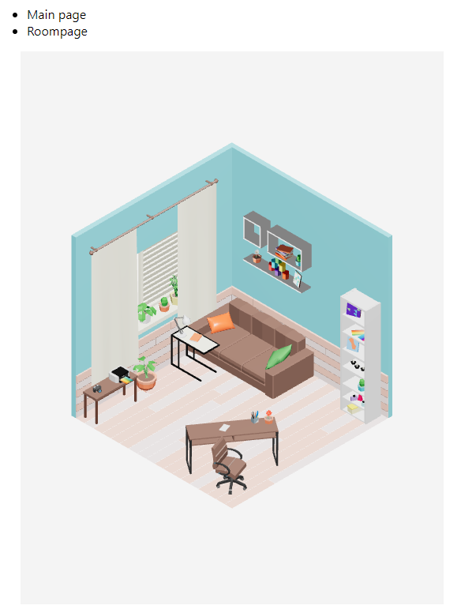

### Three.js

> example1.js 파일에 테스트.
> component/room.js 에 실 기능 작성.

구현된 코드는 test-hangeol-three.js 브랜치에 작성되어 있습니다.

react에서 three.js 사용
```
npm i three
npm install @react-three/fiber
npm install @react-three/drei
```


#### 3D Object import

일단, 3D 모델 파일 확장자가  .glTF를 쓰는데, 이걸 react에서 읽어오기 위해서 조금 조건이 필요.

~~glTF 파일이 3D로 읽히려면 기본적으로 .glTF 파일과 .bin 파일 두 개가 필요하고,~~ 
~~+알파로 텍스쳐 파일 등으로 구성 가능.~~

glb파일 확장자 사용. > glb는 gltf와 bin, texture가 통합된 파일로, 하나의 파일로 표현할 수 있음.


이걸 react 아니고 그냥 html에서 사용하려고 하면, three.js를 script로 가져와서 사용하면 되는데, 
react는 function 형태로 dom을 구성하고, 그 안에 three.js 요소를 콜백하도록 넣으면 리렌더링을 무한히 해서 react가 폭발하게 됨.

-> @react-three/drei, @react-three/fiber 라는 라이브러리 두개를 임포트하여 컴포넌트를 불러옴.

- **@react-three/drei**
react에서 3D 모델을 렌더링 하기 위한 라이브러리
- **@react-three/fiber**
렌더링한 3D 모델을 띄우기 위한 캔버스 기능을 지원하는 라이브러리.


이제 glTF(glb)를 불러와야 하는데, glTF는 JSON형태로 작성되어 있고, 
나름의 규칙이 있으나 이 규칙을 저희가 뜯어서 dom을 구성하는 건 거의 불가능에 가까워 보임.
(3D 모델 마다 포함된 오브젝트 수, 텍스쳐 수가 다르고, 이 때문에 각각에 필요한 dom 구성 자체가 달라짐.)


놀랍게도 이걸 자동화해주는 툴이 있었고, 이를 사용.
npx gltfjsx < filename >.js
glTF 파일이 있는 폴더에서 터미널을 키고 위 명령어를 치면, 알아서 glTF 파일을 react component가 제작됨. 
제작된 react component의 구조는 아래와 같음.

```js
/*
Auto-generated by: https://github.com/pmndrs/gltfjsx
*/

import React, { useRef } from 'react'
import { useGLTF } from '@react-three/drei'

export default function Model({ ...props }) {
  const group = useRef()
  const { nodes, materials } = useGLTF('/barrel.glb')
  return (
    <group ref={group} {...props} dispose={null}>
      <group scale={0.43}>
        <mesh geometry={nodes.Mesh_barrel.geometry} material={materials.cloth} />
        <mesh geometry={nodes.Mesh_barrel_1.geometry} material={materials.metal} />
      </group>
    </group>
  )
}

useGLTF.preload('/barrel.glb')
```


gltf에 포함된 각각의 object를 렌더링하고, 이를 하나의 group으로 묶어서 반환해 줌.

이걸 three.js의 Canvas 태그 안에 가져오면, 
3D 모델이 띄워짐.

방을 가져올 때, [0, 0, 0]을 중점으로 한 변이 2m인 방으로 제작.
후에 가져올 에셋들이 어느 정도 크기를 가지냐에 따라, 스케일을 따로 저장해야 할 가능성이 있음.

```
// stuff 위치 및 크기.
object.position.set(x, y, z).multiplyScalar;
// stuff 방향
object.lookAt(x, y, z);
```


3D 모델링(직접 모델링)
Inventor -> ipt 내보내기 -> 3dx Max에서 임포트
3ds Max + babylon.js 플러그인 -> glTF export

3D 에셋
??? 파일 형태 -> 3ds Max에서 임포트
3ds Max + babylon.js 플러그인 -> glTF export


#### 기본사항

제작 시 백그라운드 색 생성

```react
<Canvas onCreated={state => state.gl.setClearColor("white")>
</Canvas>
```


#### Light

- AmbientLight

  - 모든 개체들에게 전체적으로 빛을 줌

- directionLight

  - 한 방향으로 빛을 내려줌. 태양광 등의 용도로 사용.
  - shadow를 주어 그림자 등의 설정.

  ```react
  <directionalLight 
      castShadow
      position={[0, 10, 0]}
      intensity={4}
      shadow-mapSize-width={1024}
      shadow-mapSize-height={1024}
      shadow-camera-far={50}
      shadow-camera-left={-100}
      shadow-camera-right={100}
      shadow-camera-top={100}
      shadow-camera-bottom={-100}
  />
  ```

- pointLight

  - 한 점에서 주위로 퍼지는 광원

  

- 속성

  - intensity
    - 빛 세기 조절
    - 근데 1만 되도 엄청 강해짐.
  - position
    - 빛 위치 조절


빛은 3방향에서 들어오도록 세팅.
방에서 매우 먼 정면에서 intensity 1배수의 directornalLight.
방의 왼쪽 위 부분에서 intensity 3배수의 빛.

- 전체 화면을 밝히기 위해 AmbientLight를 추가로 넣었었으나,
  AmbientLight가 적용되지 않는 오브젝트가 있어 우선 삭제한 상태.

  > 원인 파악 필요.

> 위처럼 구성할 때 각 면이 적절하게 명암을 가지게 되었다.


#### Shadow

Canvas 컴포넌트 자체의 속성으로 Shadow 지정해줘야, 그림자가 나타나게 됨.

castShadow를 mesh 컴포넌트에 달아서 작성도 가능하다고 함.

> 어느것도 제대로 작동을 안함. 대안을 찾아야 함.
>
> 이게 mesh가 아니라서 castShadow가 제대로 작동을 안하는 것 같은데, mesh로 묶어도 작동을 안 해서 원인을 찾아보는 중.


#### Camera
PerspectiveCamera랑 OrthographicCamera 카메라가 존재

- PerspectiveCamera
    - 원근법을 이용해서 실제 세상처럼 보여줌.
- OrthographicCamera
    - 카메라에서 원근법을 날리고 물체를 평평하게 보여줍니다.

육각형이 깔끔하게 보여야 하므로 Ortho머시기를 디폴트로 잡고, 
카메라를 공중에 띄우고 중앙을 바라보도록 세팅.


아래 명렬어를 에셋 폴더에서 실행해서, 모델 js파일 만듬.
npx gltfjsx < filename >.js

알아서 자기 오브젝트를 컴포넌트화해서 반환해줌.
이를 Canvas 태그에 넣고 렌더링하면 됨.


카메라 실시간 업데이트를 위한 코드
useFrame -> 원근 있는 카메라. perspective camera

```
state.camera.updateProjectionMatrix()
```

기본 카메라 자체가 원근이 잡혀있음. 이 원근을 날려야 함.
-> OrthographicCamere makedefault설정을 넣어주고, zoom을 땡김.

```
zoom에 대해
70정도로 땡기면 500px에 적절히 들어맞음.
```


여러 파일을 임포트할 때, 어떻게 가져올 것?

- import를 배열로 할 수 있나?
- db에서 유저의 가구리스트를 가져온 뒤
- 그 이름에 맞춰서 db에서 js파일을 가져와서 컴포넌트로 배치
- **클로저로 컴포넌트를 반환**하게 작업.


#### Controls

당장 사용은 안하지만 필요.

- OrbitControls
  - 마우스를 이용한 줌인, 줌아웃, 이동 지원. 주로 사용됨.


##### 3D 에셋

https://www.turbosquid.com/ko/3d-models/interior-room-decoration-3d-1676554

이거 구매해서 사용


#### 3D 오브젝트 이름 규칙

```
stuff이름_색상_크기_번호
```


#### Demo room




### Room 관리

기본적으로 바닥이 xz평면. 오른쪽 벽이 xy평면, 왼쪽이 yz평면이 됨.

좌표상으로 한 방은 [ 4, 4, 4 ]사이즈의 공간이 됨.


### Stuff 관리

glb를 컴포넌트화해서 가져오면, group 컴포넌트로 묶이기 때문에, mesh의 속성(hover, click) 등을 쓸 수가 없음.

따라서, 컴포넌트 하나하나를 mesh로 묶어주어야 함.


#### 태그 표시

기본적으로, 자식 컴포넌트(stuff)에서 부모 컴포넌트(room)으로 데이터를 전송할 수 있어야 한다. 이를 가지고 부모가 클릭이벤트를 구현.

하나의 함수 틀로 다양한 변수를 받아야 하므로, 단순히 dom이 생성될 때 부모에게 정보를 전달하는 것이 아니라, 클릭에 따라 자식 컴포넌트로 넘어가서 이벤트를 작동시켜야 함. 

아래 코드는 그냥 Hover 이벤트 실행 예시

```react
<mesh onPointerOver={() => stuffhover("책상")}>
    <Table_wood_1 attatch="geometry" position={[12, -42.9, 16.2]}/>
</mesh>
```


이벤트 전달이 아래와 같은 순서로 일어남.

자식 오브젝트의 클릭/호버 -> 부모 오브젝트로 

Hover, click이벤트를 구현한 최종 Component 형태

```react
import React, { useRef, useState } from 'react'
import { useGLTF } from '@react-three/drei'

export default function Model({ Hover, Click, ...props }) {
  const [name, setName] = useState("Table_wood_1");
  
  // 부모객체의 호버, 클릭 함수 호출
  function onHover() { Hover(name); }
  function onClick() { Click(name); }

  const group = useRef()
  const { nodes, materials } = useGLTF('/stuffAssets/table_wood_1.glb')
  return (
    <group 
      onPointerOver={() => onHover()} 
      onPointerDown={() => onClick()}
      
      ref={group} dispose={null}
      castShadow
      {...props}
    >
      {/* mesh 태그들 */}
      <mesh geometry={nodes.low_poly_interior1901.geometry} material={materials.low_poly_interior} position={[-9.06, 43, -13.13]} rotation={[0, 0.95, 0]} scale={100} />
    </group>
  )
}

useGLTF.preload('/stuffAssets/table_wood_1.glb')

```


#### Hover event

태그가 완전비활성 상태라면 마우스 위치에 태그를 보여 줌.

태그가 활성화 된 상태라면, 특별히 할 일 없음.


#### Click event

스터프에 맞는 페이지를 로드함.


#### 클릭 이벤트 세팅

```react
// 호출되는 함수 부분.
function Hover(name) {
    console.log(name + " 호버");
}
function Click(name) {
    console.log(name + " 클릭");
}

<!-- mesh 부분에서 -->
<Table_wood_1 Hover={Hover} Click={Click} position={[12.06, -43, 16.13]}/>
```


---
#### 해결할 일
- ambientlight에 영향을 받지 않는 객체가 있음.
  ~~왜?~~
  - 어쩌다 보니 영향을 안받는 객체를 안 쓰게 되서 생각할 필요가 없어졌음..
  


- 구매한 에셋을 적용할 때, 원점에 맞춰지지 않는데, 이를 강제로 원점으로 끌어내릴 방법을 찾아야 함.
  **생각중인 해결책**
  - ~~오브젝트 안의 포지션을 받아와서, 이에 음수값을 입력해서 기본 위치를 0으로 맞춤.~~
    - ~~이렇게 제작할 시, 여러 메시로 하나의 모델이 구현되는 경우 처리 힘듬.~~

  - max에서 애초에 합쳐서 가져오기.
    - 가능함. 이게 가장 깔끔한 방법이지 않을까 싶은데,
      max에서 오브젝트를 합칠 때에 렌더링이 살짝 이상해지는 문제가 있음.
    - 이 문제를 해결하고, 이 방식을 사용하는 것이 홧장성 면에서 유리.


- JS 자동화 툴 만들어야 함.


---
#### 백엔드에 물어볼 것.
3D 파일이 gltf 형태를 사용하게 되면서, 파일이 여러개로 쪼개지게 되었음.
이 안에 js 파일에서 gltf파일을 참조해야 되는데, 서버에 올리면 이 경로가 어케 될지.

- 전혀 문제 안됨. 마음대로 작업해도 됨.
- gltf 안쓰고 glb를 사용하기로 하여서 다수파일 문제는 해결


#### 현재 사용하지 않지만, 필요할 수 있는 코드 저장용

- 카메라 위치, 각도 조정

```react
function RoomCamera() {
    useFrame((state) => {
        // 카메라 위치 세팅
        const distance = 40;
        state.camera.position.x = distance;
        state.camera.position.y = distance;
        state.camera.position.z = distance;


        state.camera.lookAt(0, 0, 0);

        const degree = 45;
        const anglex = -degree * Math.PI / 180;
        const angley = degree * Math.PI / 180;
        state.camera.rotation.x = -0.7;
        state.camera.rotation.z = 0.6;
        state.camera.rotation.y = angley;
    })
    return null
}
```


참고자료
https://velog.io/@gicomong/threeJS-3
https://velog.io/@iepppop/react-three.js-%EC%A0%81%EC%9A%A9%EB%B2%95
https://threejs.org/docs/#api/en/cameras/Camera
https://github.com/pmndrs/drei#perspectivecamera

- 렌더링 관련(react 아님. 그냥 three.js)
  https://velog.io/@godud2604/Three.js-3D-객체의-렌더링과-표시

https://talkwithcode.tistory.com/82

